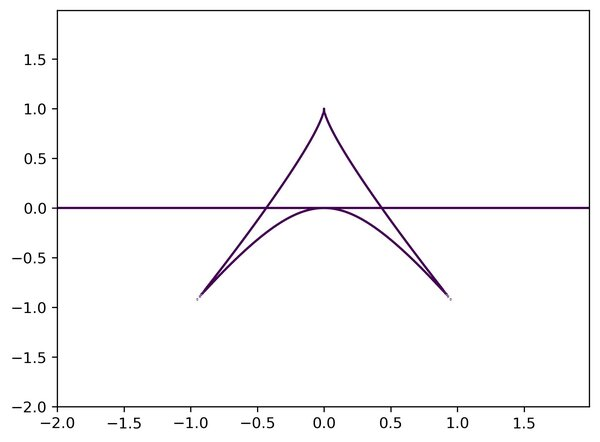

#Branch curves of cubic surfaces

Branch curves of some cubic surfaces

(This documentation will be improved)

* The first script visualizes the [real locus of the] branch curve of (a generic projection of) a smooth
cubic surface to a plane. This famous curve is also called "Zariski
sextic". It has six cuspidal points, all of them on a conic; but,
paradoxically, the same number of parameters (moduli) as any plane
sextic with six cusps, without any conditions on a conic.

It also has a large fundamental group of the complement (PSL(2,Z));
(this was an intriguing discovery of Oscar Zariski); 
much larger than in the case of a plane sextic with six cusps not on a
conic (in which this is abelian of order six).

For a geometric introduction,  please see a separate file 
[Geometric introduction](zariski-sextic.2d/Geometric-Notes.smooth-cubic-surface.md)

* The second script demonstrates the  branch curve of (a generic projection of) a 
cubic surface with a double line. 

(There are two natural notions of a branch curve in this case; the
first definition, (which can given by taking the surface
normalization, for example), gives a curve isomorphic to the classical deltoid curve;
we called this curve "the pure ramification curve" in this [Arxiv text](https://arxiv.org/abs/0903.3359).

The second definition (which can be given via the support of the sheaf
of relative differentials; or, classically, via the intersection of the surface with
the polar surface) is the union of the pure ramification  curve with the image of
the double curve (double line, in this case). 

(One can prove that the image of a double curve is always tangent to
the pure ramification curve at some smooth points on the pure ramification curve.) 

The Macaulay code intended for finding with a nicely positioned cubic
surface with a double line defined over the reals, and with all cusps
defined over the reals will be posted separately. (Moreover, we get
everything defined over the integers Z).

**Sample output**

For the smooth cubic surface:

 

 

For the cubic with a double line:

 

 


## References
 [1]: https://en.wikipedia.org/wiki/Pinch_point_(mathematics)
 [2]: https://en.wikipedia.org/wiki/Whitney_umbrella

The scripts are written in the [*surf* programming language](https://surf.sourceforge.net/) 

**Attributions**

Maxim Leyenson, 

**License**

This code is distributed under the BSD 4-Clause "Original" or "Old" License,
see the [LICENSE](BSD-4-Clause.pandoc.md) file. (That is, mention my name somewhere when you are forking the
code. I am looking for a job!)

**Synopsis**

**Usage**

For the case of a smooth cubic surface (Zariski sextic): 

```bash
      $ cd zariski-sextic.2d/sign-minus 
      $ surf-alggeo-nox curve.minus.surf
```
(creates a bunch of images)

```bash
      $ cd zariski-sextic.2d/sign-plus 
      $ surf-alggeo-nox curve.plus.surf
```

For the cubic surface with a double line (pure branch curve is a Deltoid): 
```bash
      $ cd ramification-for-a-cubic-surface-with-double-line/surf
      $ surf-alggeo-nox plot-ramification-curve.surf
```

or
```bash
      $ cd ramification-for-a-cubic-surface-with-double-line/matplotlib
      $ python3 plot-full-ramification.py
```
to see the image of the double line, too. (There is a quirk in the
Debian's version of *surf* which I am trying to bypass with *mathplotlib*)


**Requirements**

   * surf


**Installing surf**

In the Ubuntu derivatives, 
```bash
   # apt install -y  surf-alggeo-nox  
```
